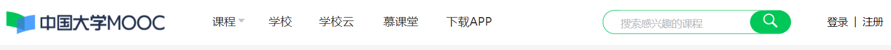
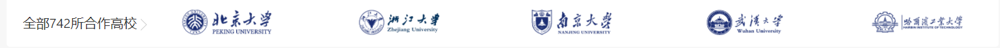
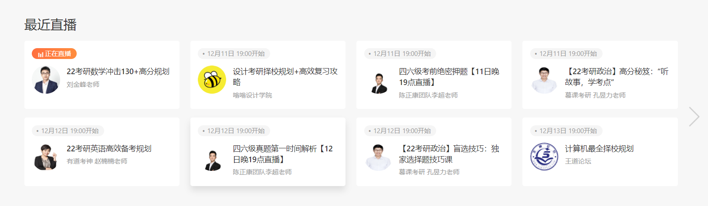
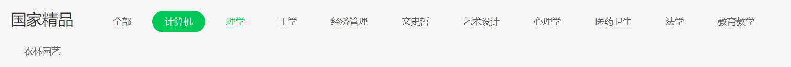
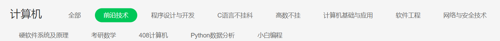
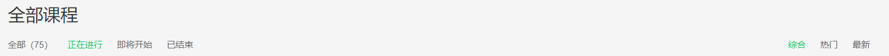
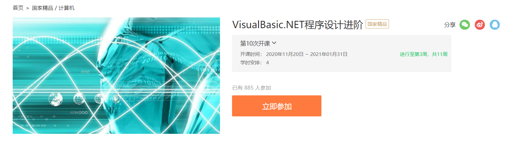
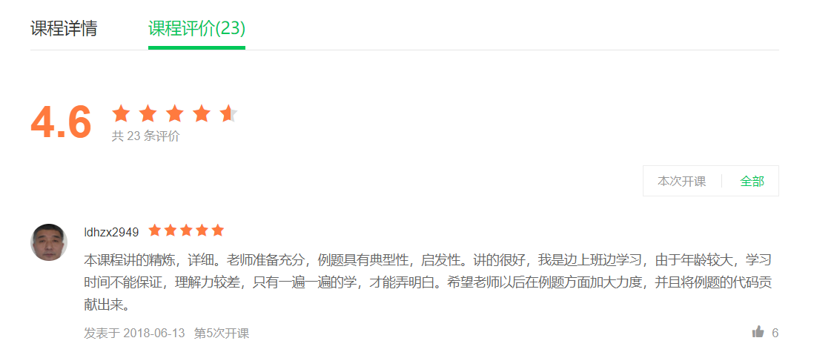
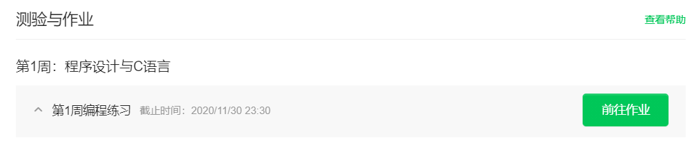

# 学生/未登录业务逻辑

## 1.首页

### 1.1 上工具栏

#### 1.1.1 (课程)按专业分类

#### 1.1.2 名师

按照课程评价最高的老师（3-5位）展示教师信息、课程、学校

API：findTeacher（Sort s）、findTeacherByID

#### 1.1.2 成为会员

- 商品展示（按会员时间）

#### 1.1.4 下载App

展示二维码下载链接/二维码

#### 1.1.5  搜索框

搜素课程名子串

返回N条记录的课程列表

渲染要求同课程信息

#### 1.1.6  登录/注册

### 1.2 首页中间页面

#### 1.2.1 课程排序检索方式选择

API：组合查询API

排序方式

- 按观看次数排序（默认）
- 按课程评分排序
- 按开课时间最新

是否付费

- 免费课程（默认）
- 付费课程

#### 1.2.2 搜素结果：

展示三个课程的课程信息

### 1.3 合作高校（上大）

### 1.4 最近直播

### 1.5 底部：版权、免责声明

## 2.专业课程页面

选择1.1.1专业后跳转

### 2.1 上展示栏

前端存储专业名字

API查找细分

### 2.2 最新好课推荐

按开课时间最新课程

### 2.3 全部课程

#### 2.3.1 工具栏

栏左：全部 免费 付费

栏右 ：热门 最新

API ：2.1集合中的细分搜素

#### 2.3.2 展示课程信息

图片、名称、老师、开始时间、观看人数

#### 2.3.3 查询分页

## 3.课程详细页面

### 3.1 课程展示页

- 导航栏
- 图片、名称
- 教师名字和专业
- 已观看人数
- 立即参加/需要会员/  其他网站课程的**网页链接**

### 3.2 课程详情（选择栏）

- 课程内容
- 课程大纲

### 3.3 课程评价（选择栏）

#### 3.3.1 课程平均分

#### 3.3.2 发布评价

- 未登录、会员课程非会员无权限
- 一个课程一个账户一次评论+打分

#### 3.3.3 课程评价

分类：好评（3-5）、差评（1-2）

按照点赞数排序

用户名、评分、评价内容（5个一页）、发布时间、点赞次数

#### 3.3.4 相关课程

同偏好观看人数最多的3个课程

## 4.课程观看页面

点击**立即报名**后跳转

侧栏：课件、作业、作业展示、经验分享

### 4.1 课件

APi：查找章节调用视频

### 4.2 作业

API：课程提纲内容、作业详细

#### 4.2.1 作业详细

作业内容（文本/文件）、截止时间

#### 4.2.2 作业状态

- 已上传：编辑、删除

- 未上传：上传

- 已批改：回复、成绩

- 已驳回：回复

- 已截止

点击状态栏：页面显示已有文件 + （回复、成绩）

### 4.3 作业展示

按照章节、作业得分排序

作者、文件、得分

### 4.4 经验分享

作者、分享文本、点赞数

# 教师登录业务逻辑

## 1.修改个人信息

## 2. 管理课程

新建：课程信息栏（专业领域绑定）

删除：提问确认、不立即删除、改变课程状态提交给管理员

管理课程：修改课程名、添加、删除章节；修改课程章节名；是否需要会员

### 2.1 任务管理

新建：任务信息栏（内容、作业要求文件、截止时间）

删除：提问确认、立即删除

管理任务：修改（内容、任务要求文件、截止时间）

 - 任务要求文件管理：增、删

#### 2.1.1 管理已提交

作业列表：提交学生姓名、提交时间、提交文件列表

作业列表（右按键）：批改、驳回

 - 批改：填写回复、分数

 - 驳回：填写回复

作业批改状态（对应按键）：

 - 已批改：批改->批改信息

 - 已截止：无按键

### 2.2 课程详细信息

- 参加人次：会员人次 + 非会员人次

- 平均得分 + 评论栏（同3.3.3）

## 3. 管理直播

新建：任务信息栏（内容、直播地址、开播时间）

删除：提问确认、立即删除

## 4. 管理专业领域

新建：专业领域内容

查看已有

# 管理员业务逻辑

