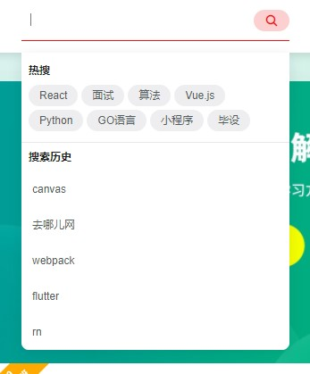
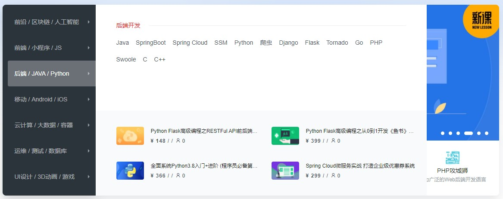

# Online-Education-Fronted

参考网址：

[mooc]: https://imooc.funpython.cn/#/home	"慕课网"

## 首页

### header

- 慕课图标
- 分类目录\*5
- 搜索框
    - 推荐算法框
    - 搜索按钮
    - 获得焦点：出现搜索提示框（热搜、搜索历史）

- 分类目录\*2
- 购物车
    - 课程数
    - 购物车内容
    - 按钮\*2

- 登录
- 注册

### nav1

- 课程分类栏\*7
    - 详细信息
    - 课程

- 轮播图
- 模块*5

### nav2

- 标题
- 热点资讯\*2
- 内容，每行5个动态载入

### article1

- 标题
- 左中右三栏评论，目前我们实现文章数量等分至左中右三个盒子动态加载就可以

### article2

- 标题
- 轮播图
    - 教师，同时展示5个（动态效果实现）

### footer

- 标题
- 明星，不超过5个
- 不那么明的星，一行不超过10个
- 链接\*9
- 网站信息
- 微信、微博
    - 二维码

### sider

- 模块\*5
    - 二维码\*2

- 返回顶部按钮（拉到nav1看不见处出现）