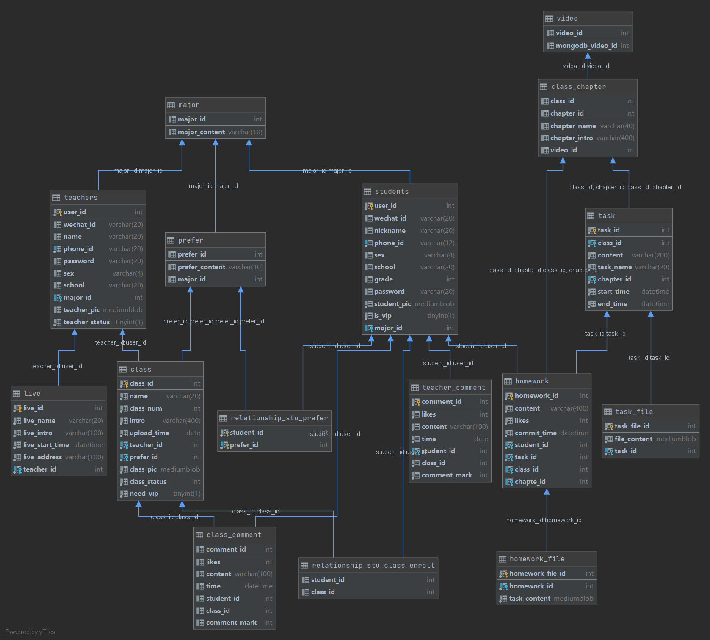

### 关系模式

1. 学生表（**用户ID**、微信ID、昵称、手机号（唯一）、密码、性别、所属院校、年级、学生图片、会员标志、`专业ID`)

关系：偏好（多对多）、报名课程（多对多）

2. 教师（**教师ID**、微信ID、真实姓名、手机号（唯一）、密码、性别、院校、教师图片、教师状态、`专业ID`）

3. 课程（**课程ID**、课程名、课程简介、课时数、上传时间、课程图片、课程状态、是否需要会员、`偏好ID`、`教师ID`)

关系：报名学生（多对多）、课程评价（一对多）

4. 课程章节（**课程ID+章节ID**、章节名称、章节简介、`课程视频ID`）

5. 任务（**任务ID**、任务名称、任务内容、开始时间、截止时间、`课程ID+章节ID`）

  关系：任务文件ID（一对多）

6. 作业（**作业ID**、作业内容、作业回复、作业评分、是否被展示、作业点赞数（学生点赞）、提交时间、作业状态、`学生ID`、`任务ID`、`课程ID+章节ID`）
  
7. 课程评论（**课程评论ID**、点赞数、评论内容、评论时间、评分、`学生ID`、`课程ID`)
  
8. 教师评价（**教师评论ID**、点赞数、评论内容、评论时间、评分、`学生ID`）

9. 专业（**专业ID**、专业内容）

10. 偏好（**偏好ID**、偏好内容、`专业ID`）
  
11. 直播：（**直播ID**、直播通道、直播题目、教师、直播简介、开播时间、直播状态、`教师ID`）

### 文件关系模式表

1. 课程章节视频（**视频ID**、Mangodb主键ID）

2. 任务文件（**任务文件ID**、文件内容、`任务ID`）

3. 作业文件（**作业文件ID**、文件内容、`作业ID`）

### 关系数据表

- 偏好与学生：学生ID、偏好ID（多对多）
- 课程与学生（报名）：学生ID、课程ID（多对多）

### ER图

### 数据表图

